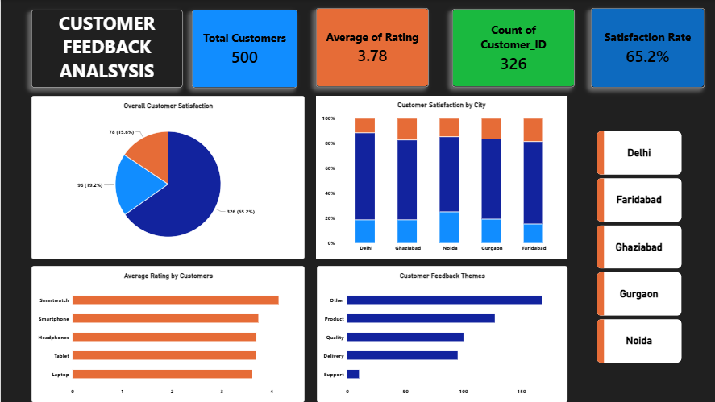

# Customer Feedback & Satisfaction Analysis

## Project Overview

Analyzed **500 customer records** to evaluate customer satisfaction, ratings, city-wise performance, and feedback themes using **Excel and Power BI**.

## Objective

* Analyze overall customer satisfaction and ratings
* Compare satisfaction levels across **5 cities**
* Identify customer feedback patterns and themes
* Develop an interactive dashboard for clear data-driven insights

## Dataset

* **500 customer records**
* **5 cities:** Delhi, Faridabad, Ghaziabad, Gurgaon, and Noida
* **326 satisfied customers**
* **96 neutral customers**
* **78 unsatisfied customers**
* **65.2% overall satisfaction rate**
* **3.78 average customer rating**

## Tools & Technologies

* **Microsoft Excel:** Data cleaning, organization, PivotTables, and analysis
* **Power BI:** Data visualization, KPI cards, charts, slicers, and interactive dashboard

## Analysis Performed

* Cleaned and organized customer feedback data in Excel
* Analyzed overall satisfaction and customer ratings
* Compared satisfaction levels across 5 cities
* Analyzed average ratings by customer category
* Examined customer feedback themes
* Created an interactive Power BI dashboard with KPIs and visualizations

## Key Metrics

| Metric                | Value |
| --------------------- | ----: |
| Total Customers       |   500 |
| Satisfied Customers   |   326 |
| Neutral Customers     |    96 |
| Unsatisfied Customers |    78 |
| Satisfaction Rate     | 65.2% |
| Average Rating        |  3.78 |
| Cities Analyzed       |     5 |

## Dashboard Preview

## Files

* `Customer_Feedback_Analysis.xlsx` — Excel-based data cleaning and analysis
* `customer feedback analysis bi.pbix` — Power BI interactive dashboard
* Dashboard preview — Power BI dashboard screenshot

## Skills Demonstrated

**Excel | Data Cleaning | Data Analysis | PivotTables | Power BI | Data Visualization | Dashboard Development | KPI Analysis | Customer Satisfaction Analysis**

